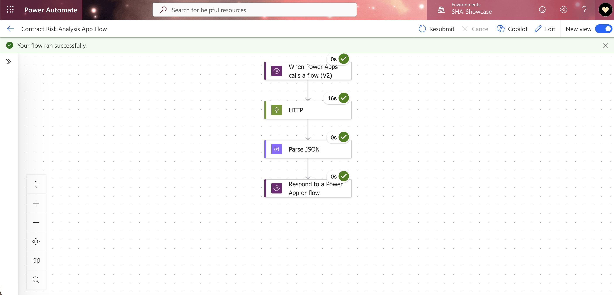
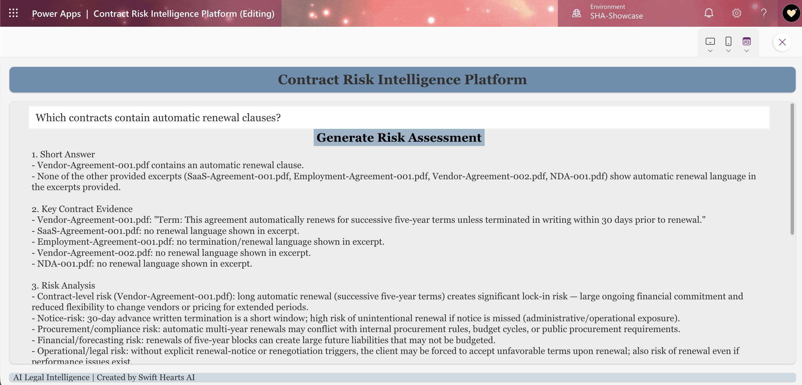
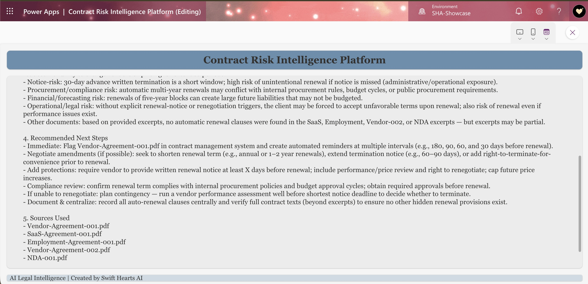
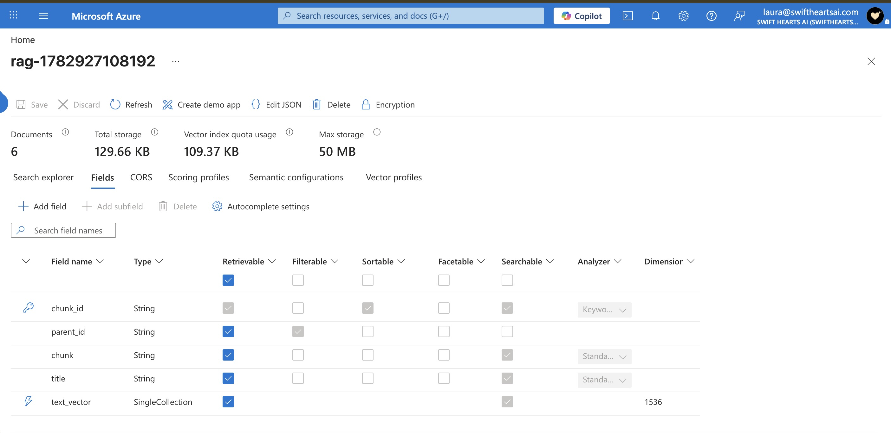

# Contract Risk Intelligence Platform

## Overview

The Contract Risk Intelligence Platform is an AI-powered legal document analysis solution built on Microsoft Azure. The platform uses Retrieval-Augmented Generation (RAG) to help legal professionals analyze contracts, identify potential risks, and receive grounded responses supported by source citations.

Instead of relying solely on general AI model knowledge, the solution retrieves relevant contract language from Azure AI Search and uses GPT-5-mini to generate responses based on actual document content.

---

## Business Problem

Legal teams often spend significant time:

- Reviewing large collections of contracts
- Identifying risk exposure
- Locating specific clauses
- Comparing terms across agreements

Manual review can be time-consuming and difficult to scale.

---

## Solution

The Contract Risk Intelligence Platform allows users to ask natural-language questions about contracts and receive AI-generated analysis with supporting citations.

### Example Questions

```text
Which contracts contain automatic renewal clauses?

Which agreements allow termination without cause?

Which contracts expose the client to unlimited liability?

What confidentiality obligations survive termination?
```

---

## Architecture

```text
Power Apps
      ↓
Power Automate
      ↓
Azure Function
      ↓
Azure AI Search
      ↓
GPT-5-mini
      ↓
Contract Risk Analysis
      ↓
Filename-Based Citations
      ↓
Power Apps
```

---

## Solution Screenshots

### Azure AI Model Deployments


GPT-5-mini and text-embedding-3-small are deployed within Azure AI Foundry to provide contract reasoning and vector embedding generation.

---

### Power Automate Integration



Power Automate orchestrates communication between Power Apps and the Azure Function API, enabling secure and scalable contract analysis workflows.

---

### Power Apps Contract Risk Analysis



Legal professionals can ask natural-language questions and receive AI-generated risk analysis grounded in contract content retrieved through Azure AI Search.

---

### Citation Transparency



Responses include filename-based citations that improve traceability, transparency, and legal review workflows.

Example citation output:

```text
Vendor-Agreement-001.pdf

SaaS-Agreement-001.pdf

Employment-Agreement-001.pdf
```

---

### Azure AI Search Vector Index



Contract chunks, metadata, and embeddings are stored in Azure AI Search to support semantic retrieval and Retrieval-Augmented Generation (RAG).

---

## Technology Stack

### Azure

- Azure AI Foundry
- Azure AI Search
- Azure Blob Storage
- Azure Functions

### AI Models

- GPT-5-mini
- text-embedding-3-small

### Development

- Python
- OpenAI SDK
- Azure Search SDK
- REST APIs

### Power Platform

- Power Apps
- Power Automate

---

## Key Features

✅ Retrieval-Augmented Generation (RAG)

✅ Vector Search

✅ Semantic Search

✅ GPT-Powered Contract Analysis

✅ Filename-Based Citations

✅ Azure Function API

✅ Power Apps Interface

✅ Production Azure Deployment

---

## Citation Enhancement

The platform was enhanced to improve transparency and legal traceability.

### Previous Citation Format

```text
[Source 1]
[Source 2]
```

### Enhanced Citation Format

```text
NDA-001.pdf

Vendor-Agreement-001.pdf

Employment-Agreement-001.pdf
```

This enhancement allows legal professionals to immediately identify supporting source documents and validate AI-generated responses more efficiently.

---

## Repository Structure

```text
Contract-Risk-Intelligence-Platform
│
├── Docs
│   └── architecture-notes.md
│
├── Src
│   └── contract_risk_app.py
│
├── Screenshots
│   ├── 02-model-deployments.png
│   ├── 03-power-automate-flow.png
│   ├── 04-power-app-question-analysis.png
│   ├── 05-power-app-citations.png
│   └── 06-vector-search-fields.png
│
├── function_app.py
├── host.json
├── requirements.txt
└── README.md
```

---

## Project Status

### Version 1.0

✅ Azure Infrastructure

✅ Azure AI Search

✅ Contract Indexing

✅ Python RAG Application

✅ Azure Function Deployment

✅ Power Automate Integration

✅ Power Apps Integration

✅ Citation Enhancement

✅ End-to-End Testing

✅ Production Deployment

---

## Future Enhancements

### Phase 6

- Law Firm Demo Website
- Contract Upload Portal
- Automated Contract Ingestion
- Expanded Risk Analysis Framework

---

## Final Outcome

Successfully designed, developed, and deployed an end-to-end Azure-based AI solution that performs contract risk analysis using Retrieval-Augmented Generation, Azure AI Search, GPT-5-mini, Azure Functions, Power Automate, Power Apps, and filename-based citations.

**Technologies Demonstrated:**

- Azure AI Foundry
- Azure AI Search
- Vector Search
- Retrieval-Augmented Generation (RAG)
- GPT-5-mini
- text-embedding-3-small
- Azure Functions
- Power Automate
- Power Apps
- Python
- REST APIs

🚀 **Status: Deployed and Operational**